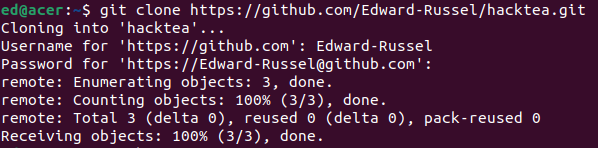

# Шпаргалка по git
Источники:
- [Часть 1. Установка и настройка Git. Создание, клонирование репозитория. Ветки. Состояние проекта.](https://techrocks.ru/2021/04/04/how-to-use-git-part-1/)
- [Часть 2. Загрузка изменений на сервер. Совместная работа в Git.](https://techrocks.ru/2021/04/06/how-to-use-git-part-2/)
- [Углублённое изучение Git.](https://smartiqa.ru/courses/git/lesson-1)

### Клонирование репозитория
Клонирование репозитория – это копирование удаленного репозитория на локальную машину для дальнейшей работы с ним.
```
git clone https://github.com/Edward-Russel/hacktea.git
```
Далее вводим свой ник на GitHub и access token вместо пароля.



### Состояния проекта
Локальные изменения
```
git status
```
Посмотреть, изменилось ли что-то в удалённом репозитории
```
git fetch origin
```
Синхронизировать локальный и удалённый репозиторий
```
git merge origin/<название ветки>
```
То же самое, что `git fetch` + `git merge`
```
git pull
```

### Ветки
Ветки нужны для распараллеливания работы над проектом. Самая главная ветка называется `main`.

Создание ветки
```
git branch <название ветки>
```

Переключение на другую ветку
```
git checkout <название ветки>
```

Слияние веток
```
git checkout main
git merge <слияемая ветка>
```

###  Загрузка изменений на сервер
1) Синхронизируемся с удалённым репозиторием
```
git pull
```
2) Фиксируем наши изменения
```
git add .
```
3) Сохраняем изменения и добавляем краткое описание внесённых изменений
```
git commit -m "a message describing the changes"
```
4) Отправляем изменения на сервер в `origin` (GitHub)
```
git push origin <название ветки>
```

### Разрешение конфликтов слияния
[Теоритический блок. 3. Разрешение конфликтов слияния.](https://smartiqa.ru/courses/git/lesson-5)